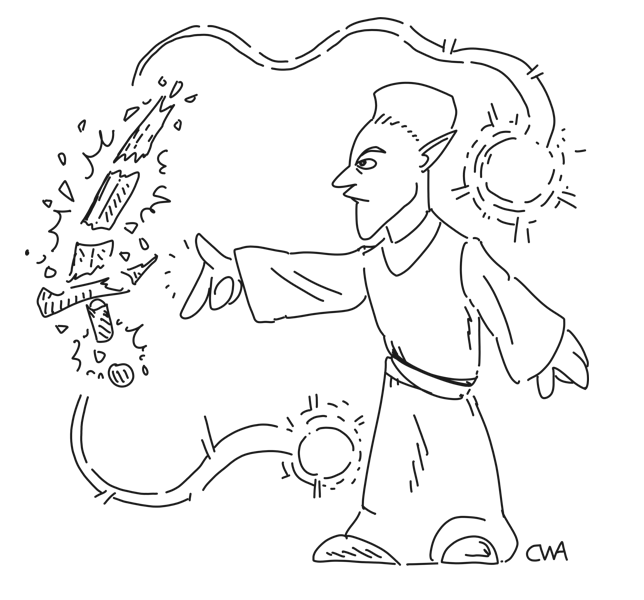

# Absorb & Ascend
Destroy a magic item and absorb its power!

## Features

This mod enables you to "consume" a magic weapon, armor, or clothing item. You'll then gain experience based on the magic school(s) of the enchantment, plus a small experience gain for the enchant skill. The item is destroyed in the process.

Enchanted thrown weapons and ammo cannot be consumed this way.

_This mod requires OpenMW 0.49!_

## How to use

While in the inventory menu, hold Shift+Alt, then "equip" the magic item. The keys are configurable.

## Notes on the calculation

The experience is calculated as follows:

_Item charge/20 + Enchantment cost/2, multiplied with 1 + (((intelligence+enchant)/5 + luck/10)/100)_

This calculation is very close to the [“enchantment chance”](https://en.uesp.net/wiki/Morrowind:Enchant#Enchanting_items). However, there is no chance of failure; the process is always successful.

It should be noted that the engine interprets gained experience differently based on the magic school. For example, destruction experience gains are smaller, while experience gain for conjuration is more impactful.

Also, due to how the game engine works, it isn't possible to gain more than one level at once.

## Development

Possible future features to implement:

* Enabling absorption of enchanted thrown weapons and ammo
* Requiring a certain level of enchant to use the absorption ability, or:
* Add the chance of failure with a very low enchant skill

**I hope you'll enjoy my mod!**